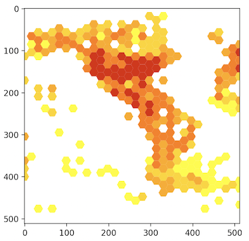

pygbif
======

[](https://pypi.python.org/pypi/pygbif)
[](http://pygbif.rtfd.org/)
[](https://travis-ci.org/sckott/pygbif)
[](https://coveralls.io/github/sckott/pygbif?branch=master)

Python client for the [GBIF API](http://www.gbif.org/developer/summary)

Source on GitHub at [sckott/pygbif](https://github.com/sckott/pygbif)

Other GBIF clients:

* R: [rgbif - ropensci/rgbif](https://github.com/ropensci/rgbif)
* Ruby: [gbifrb - sckott/gbifrb](https://github.com/sckott/gbifrb)

## Installation

Stable from pypi

```
pip install pygbif
```

Development version

```
[sudo] pip install git+git://github.com/sckott/pygbif.git#egg=pygbif
```

`pygbif` is split up into modules for each of the major groups of API methods.

* Registry - Datasets, Nodes, Installations, Networks, Organizations
* Species - Taxonomic names
* Occurrences - Occurrence data, including the download API
* Maps - Maps, get raster maps from GBIF as png or mvt

You can import the entire library, or each module individually as needed.

In addition there is a utils module, currently with one method: `wkt_rewind`

## Registry module

registry module API:

* `organizations`
* `nodes`
* `networks`
* `installations`
* `datasets`
* `dataset_metrics`
* `dataset_suggest`
* `dataset_search`

Example usage:

```python
from pygbif import registry
registry.dataset_metrics(uuid='3f8a1297-3259-4700-91fc-acc4170b27ce')
```

## Species module

species module API:

* `name_backbone`
* `name_suggest`
* `name_usage`
* `name_lookup`
* `name_parser`

Example usage:

```python
from pygbif import species
species.name_suggest(q='Puma concolor')
```

## Occurrences module

registry module API:

* `search`
* `get`
* `get_verbatim`
* `get_fragment`
* `count`
* `count_basisofrecord`
* `count_year`
* `count_datasets`
* `count_countries`
* `count_schema`
* `count_publishingcountries`
* `download`
* `download_meta`
* `download_list`
* `download_get`

Example usage:

```python
from pygbif import occurrences as occ
occ.search(taxonKey = 3329049)
occ.get(key = 252408386)
occ.count(isGeoreferenced = True)
occ.download('basisOfRecord = LITERATURE')
occ.download('taxonKey = 3119195')
occ.download('decimalLatitude > 50')
occ.download_list(user = "sckott", limit = 5)
occ.download_meta(key = "0000099-140929101555934")
occ.download_get("0000066-140928181241064")
```

## Maps module

maps module API:

* `map`

Example usage:

```python
from pygbif import maps
out = maps.map(taxonKey = 212, year = 1998, bin = "hex",
       hexPerTile = 30, style = "classic-noborder.poly")
out.response
out.path
out.img
out.plot()
```



## utils module

utils module API:

* `wkt_rewind`

Example usage:

```python
from pygbif import utils
x = 'POLYGON((144.6 13.2, 144.6 13.6, 144.9 13.6, 144.9 13.2, 144.6 13.2))'
utils.wkt_rewind(x)
```

## Contributors

* `Scott Chamberlain <https://github.com/sckott>`_
* `Robert Forkel <https://github.com/xrotwang>`_
* `Jan Legind <https://github.com/jlegind>`_
* `Stijn Van Hoey <https://github.com/stijnvanhoey>`_
* `Peter Desmet <https://github.com/peterdesmet>`_

## Meta

* License: MIT, see [LICENSE file](LICENSE)
* Please note that this project is released with a [Contributor Code of Conduct](CONDUCT.md). By participating in this project you agree to abide by its terms.
